# czcode — ClickZetta Lakehouse AI Agent

czcode 是专为 ClickZetta Lakehouse 用户打造的终端 AI Agent，使用 Claude、Qwen 等大模型驱动。

<p align="center">
  
</p>

---

## 你可以用 czcode 做什么

czcode 覆盖三类场景，通过角色切换在同一个工具里完成：

### 场景一：Lakehouse 数据工作（数据角色）

面向数据分析师、数据工程师、数据科学家、数据运维、数据治理人员。czcode 理解 Lakehouse 的对象模型、SQL 方言和运维体系，可以：

- **自然语言查询**：用中文描述需求，自动生成 SQL 并执行，结果以表格展示
- **数仓建模**：设计分层架构（ODS/DWD/DWS/ADS 或 Medallion），生成 DDL 和数据管道
- **数据探查**：`/cz_sample` 采样、`/cz_count` 行数、`/cz_profile` 数据画像
- **运维管理**：VCluster 启停扩缩容、作业监控、慢查询分析、权限管理
- **安全确认**：DDL/DML 操作弹窗确认，DROP/TRUNCATE 显示表大小和行数，防止误操作

**角色切换**：
- **`/agents`** — 弹出完整角色列表，可切换所有角色（数据角色 + code/plan/debug/ask）
- **`/cz_role`** — 仅显示数据角色列表（数据分析师/工程师/科学家/运维/治理）
- **Tab 键** — 在输入框按 Tab 循环切换角色
- **`czcode.jsonc`** 中设置 `default_agent` 固定默认角色

---

### 场景二：Lakehouse 应用开发（Code/Plan 角色 + Lakehouse Skills）

面向需要基于 Lakehouse 进行应用开发的工程师。czcode 内置 Lakehouse 应用开发 Skills，让 AI 在写代码时自动掌握正确的 SDK 用法和最佳实践：

- **SQL 任务开发**：编写复杂 SQL、调度脚本，理解 ClickZetta SQL 方言和函数
- **数据应用**：Streamlit 数据看板、dbt 数据转换模型、Jupyter 分析报告
- **Python 应用集成**：`clickzetta-connector-python` 查询、参数绑定、批量插入；`clickzetta-ingestion-python` BulkLoad 高吞吐写入；`clickzetta-ingestion-python-v2` IGS 实时写入（秒级可查，支持主键表 CDC）；SQLAlchemy dialect
- **Java SDK**：BulkloadStream 批量写入（列索引 API）、RealtimeStream Kafka 实时写入（列名 API），自动区分两者的 URL 参数差异
- **Spark / Flink**：Spark DataFrame 读写、Flink CDC 同步（`igs-dynamic-table`）和仅追加模式，自动处理主键表限制
- **Dynamic Table**：设计自动刷新数据管道，支持参数化刷新（`SESSION_CONFIGS()`），替代传统调度器的 `${bizdate}` 变量

示例：在 `code` 角色下直接描述需求：
```
用 Java SDK 消费 Kafka topic "orders"，实时写入 Lakehouse 的 realtime_orders 表
```
czcode 会自动选择 RealtimeStream（而非 BulkloadStream），使用列名 API，URL 用 `vcluster=` 参数，生成完整可运行的代码。

---

### 场景三：通用软件开发（Code/Plan/Debug 角色）

czcode 完整继承自 [KiloCode](https://github.com/Kilo-Org/kilocode)，具备完整的通用代码开发能力，与 Lakehouse 无关的项目同样适用：

- **多语言支持**：Python、Java、TypeScript、Go、Rust 等
- **代码生成与重构**：实现功能、重构代码、解释代码
- **调试**：分析报错、定位 bug、修复问题
- **项目规划**：`plan` 角色设计架构方案，`debug` 角色专注问题排查

**角色切换**：输入 `/agents` 弹出完整角色列表，或按 **Tab 键**循环切换，或在 `czcode.jsonc` 中设置 `default_agent` 固定默认角色。

---

## 安装

### 第一步：下载安装包

前往 [Releases 页面](https://github.com/yunqiqiliang/czcode/releases/latest) 下载对应平台的安装包：

| 平台 | 文件名 |
|---|---|
| macOS (Apple Silicon) | `czcode-darwin-arm64.zip` |
| macOS (Intel) | `czcode-darwin-x64.zip` |
| Linux (x64) | `czcode-linux-x64.tar.gz` |
| Linux (ARM64) | `czcode-linux-arm64.tar.gz` |
| Windows (x64) | `czcode-windows-x64.zip` |

### 第二步：解压

**macOS / Linux：**

```bash
# macOS (Apple Silicon 示例)
cd ~/Downloads
unzip czcode-darwin-arm64.zip
cd czcode-darwin-arm64
chmod +x czcode
```

> **macOS 提示"已损坏，无法打开"**：这是 macOS Gatekeeper 的安全限制，因为二进制未经 Apple 签名。运行以下命令解除限制：
> ```bash
> xattr -d com.apple.quarantine ~/Downloads/czcode-darwin-arm64/czcode
> ```

```bash
# Linux
cd ~/Downloads
tar -xzf czcode-linux-x64.tar.gz
cd czcode-linux-x64
chmod +x czcode
```

**Windows：**

解压 `czcode-windows-x64.zip` 即可使用。

### 第三步：配置 Lakehouse 连接

在解压后的目录里创建 `.env` 文件，填入你的 Lakehouse 连接信息：

```bash
# 进入解压后的目录（macOS Apple Silicon 示例）
cd ~/Downloads/czcode-darwin-arm64
```

用文本编辑器创建 `.env` 文件，内容如下：

```env
# AI 模型（默认使用阿里云 DashScope/Qwen）
DASHSCOPE_API_KEY=sk-...

# ClickZetta Lakehouse 连接信息（必填）
CLICKZETTA_SERVICE=<your-service-endpoint>
CLICKZETTA_INSTANCE=<your-instance>
CLICKZETTA_WORKSPACE=<your-workspace>
CLICKZETTA_USERNAME=<your-username>
CLICKZETTA_PASSWORD=<your-password>

# ClickZetta Lakehouse 连接信息（可选，有默认值）
CLICKZETTA_SCHEMA=<your-schema>      # 默认 public
CLICKZETTA_VCLUSTER=<your-vcluster>  # 默认 default

# 界面语言（可选，默认中文）
# CZCODE_LANG=en                     # 英文界面
# CZCODE_LANG=zh                     # 中文界面（默认）
```

> 也支持 OpenAI、Anthropic 等其他 AI 模型，详见下方"配置说明"。

### 第四步：启动

```bash
# 在解压后的目录里启动（macOS Apple Silicon 示例）
cd ~/Downloads/czcode-darwin-arm64
./czcode
```

czcode 会自动读取当前目录下的 `.env` 文件加载 Lakehouse 连接配置。

---

## 三个页面

czcode 有三个主要页面，不同页面能做的事差别很大。

### 欢迎页（启动后的默认页面）

启动 czcode 后首先看到的是欢迎页。在这里你可以：

- **开始新对话**：在输入框输入任何内容，按 Enter 进入对话页
- **恢复历史对话**：输入 `/sessions` 浏览并恢复之前的对话
- **切换角色**：按 **Tab 键**循环切换，或输入 `/agents`（所有角色）/ `/cz_role`（数据角色）
- **切换模型**：输入 `/models`
- **切换主题**：输入 `/themes`

> 欢迎页没有活跃的 AI 会话，**数据查询类命令在此无法使用**。

### 对话页（AI 工作的主战场）

在欢迎页输入内容后进入对话页。这里是 czcode 的核心，所有 AI 能力都在这里发挥：

- **自然语言对话**：直接描述需求，AI 生成 SQL 并执行，结果以表格展示
- **工具执行**：AI 可以查询 Lakehouse、读写文件、执行命令
- **数据探查命令**（仅对话页可用，在欢迎页执行会提示"请先进入对话"）：

| 命令 | 说明 |
|------|------|
| `/cz_sample` | 快速采样：输入表名，执行 `SELECT * LIMIT 5` |
| `/cz_count` | 行数统计：查看表的总行数 |
| `/cz_profile` | 数据画像：分析每列的 NULL 比例、唯一值、最大最小值 |
| `/cz_vcluster` | VCluster 状态：查看所有 VCluster 的运行状态 |
| `/cz_sql_history` | SQL 历史：浏览本次会话的 SQL 执行记录，选中即复制 |

右侧边栏实时显示 Lakehouse 连接状态（Workspace / Schema / VCluster / User）、Schemas 列表和 VCluster 状态。

### SingClaw 页（本地 AI 服务对话）

输入 `/cz_singclaw` 从任意页面进入 SingClaw 页。[SingClaw](https://www.singclaw.ai/documents/introduction) 是一款本地运行的 AI 数据分析 Agent（Mac/Windows 桌面应用），数据不出本地，适合对数据隐私有要求的场景：

- 与本地 SingClaw 服务进行流式对话
- 从**对话页**进入时，自动携带当前会话的上下文（最近的 SQL 和数据结果）
- 从**欢迎页**进入时，为纯对话模式，无会话上下文
- 对话结束后按 **Esc** 返回原来的页面

> 使用前需要在本地启动 SingClaw（openclaw-gateway），默认连接 `localhost:9999`。详见 [SingClaw 文档](https://www.singclaw.ai/documents/introduction)。

---

## 数据角色

czcode 内置 5 个数据角色 + ask 角色，共 6 个，在输入框按 **Tab 键**循环切换，或输入 `/cz_role` 弹出选择列表：

| 角色 | 说明 | 权限 |
|---|---|---|
| 数据分析师（默认） | 查询/报表/数据质量探查/BI 连接 | 仅 SELECT，工具层强制只读 |
| 数据工程师 | 建表/建模/ETL/Pipeline/调度/指标管理 | DDL + DML + SELECT，写操作需确认 |
| 数据科学家 | Python/Jupyter/EDA/特征工程/模型推理 | 写操作需确认 |
| 数据运维 | VCluster 管理/查询调优/作业监控/费用分析 | DDL + VCluster ops，写操作需确认 |
| 数据治理 | 权限/安全/生命周期/合规/共享 | GRANT/REVOKE/POLICY，写操作需确认 |
| ask | 快速问答，不执行工具，仅对话 | 只读，不调用任何工具 |

> 切换到 Code/Plan/Debug 等通用开发角色后，可进行与 Lakehouse 无关的软件开发任务，详见上方"场景三"。

---

## 主要功能

### 自然语言查询
直接用中文描述需求，czcode 生成 SQL 并执行：
- SELECT 查询直接执行，结果以表格展示，附带执行耗时（⏱ 1.2s）
- DDL/DML 操作弹窗确认，危险操作（DROP/TRUNCATE）显示目标表大小、行数、最后修改时间

### 快捷命令

| 命令 | 别名 | 功能 |
|------|------|------|
| `/agents` | — | 角色切换：弹出完整列表，切换所有角色（数据角色 + code/plan/debug/ask） |
| `/cz_role` | `/cz_r` | 角色切换：仅显示数据角色列表 |
| `/cz_sample` | `/cz_s` | 快速采样：输入表名，自动执行 `SELECT * FROM table LIMIT 5`（仅对话页） |
| `/cz_count` | `/cz_c` | 行数统计：一键查看表的总行数（仅对话页） |
| `/cz_profile` | `/cz_p` | 数据画像：自动分析每列的 NULL 比例、唯一值、最大最小值（仅对话页） |
| `/cz_vcluster` | `/cz_vc` | VCluster 状态：查看所有 VCluster 的运行状态和规格（仅对话页） |
| `/cz_sql_history` | `/cz_sh` | SQL 历史：浏览当前会话的 SQL 执行记录，选中即复制到剪贴板（仅对话页） |
| `/cz_singclaw` | `/singclaw` | SingClaw：连接本地 SingClaw 服务进行对话 |
| `/cz_skill-update` | — | 更新 ClickZetta 领域知识（Skills） |
| `/cz_skill-fix` | — | 修正 Skill 内容错误 |

### 数仓建模向导

切换到数据工程师角色后，输入"帮我设计数仓分层"，czcode 会：
1. 自动探索你的数据（SHOW SCHEMAS/TABLES，查表大小）
2. 给出具体的分层方案选项（传统分层 / Medallion / 混合）
3. 生成 DDL 模板和数据管道配置

### DDL 确认增强

执行危险操作（DROP/TRUNCATE/ALTER/DELETE）时，确认弹窗会额外显示：
- 目标表大小（MB）
- 行数
- 最后修改时间
- 支持 UNDROP 的对象会提示恢复命令

### Skills（领域知识）

czcode 内置 31 个 ClickZetta Lakehouse 领域 Skill，覆盖 SQL 语法、数据导入、索引管理、VCluster 运维等场景。Skills 随安装包一起分发，无需网络即可使用。

更新 Skills：
```
/cz_skill-update
```

> **国内用户注意**：Skills 更新需要访问 GitHub。如无法访问，请配置代理（如 `export https_proxy=http://127.0.0.1:7890`）后再运行。

报告 Skill 问题：
- 在对话中运行 `/cz_skill-fix` 写入本地修正
- 或到 GitHub 提交 Issue：[报告问题](https://github.com/yunqiqiliang/clickzetta-skills/issues/new?template=skill-bug.yml) | [提改进建议](https://github.com/yunqiqiliang/clickzetta-skills/issues/new?template=skill-enhancement.yml)

---

## 配置说明

czcode 有两层配置，优先级从高到低：

### 1. 项目配置（当前目录）

在 czcode 运行目录创建 `czcode.jsonc`，只影响当前项目：

```jsonc
{
  "model": "alibaba-cn/qwen3.5-plus",
  "default_agent": "lh-analyst"
}
```

### 2. 全局配置（用户目录）

全局配置在 `~/.config/czcode/config.json`，影响所有项目：

```json
{
  "model": "alibaba-cn/qwen3.5-plus",
  "default_agent": "lh-analyst",
  "skills": {
    "paths": ["/path/to/local/clickzetta-skills"]
  }
}
```

> **macOS 路径**：`~/.config/czcode/config.json`
> **Linux 路径**：`~/.config/czcode/config.json`（遵循 XDG 规范）

### 默认值

不创建任何配置文件时，czcode 使用以下默认值：

| 配置项 | 默认值 | 说明 |
|--------|--------|------|
| `model` | `alibaba-cn/qwen3.5-plus` | 需要 `.env` 中的 `DASHSCOPE_API_KEY` |
| `default_agent` | `lh-analyst` | 数据分析师（只读） |

### 更多模型选择

`model` 字段格式为 `<providerID>/<modelID>`，providerID 决定了调用哪个服务端点和使用哪个 API Key：

```jsonc
{
  // 阿里云 DashScope（默认，需要 DASHSCOPE_API_KEY）
  "model": "alibaba-cn/qwen3.5-plus",

  // Anthropic（需要 ANTHROPIC_API_KEY）
  // "model": "anthropic/claude-sonnet-4-6",

  // OpenAI（需要 OPENAI_API_KEY）
  // "model": "openai/gpt-4o",
}
```

### 自定义 Base URL（代理 / 私有部署）

如果你通过代理或私有部署访问模型，可以在 `provider` 字段里覆盖 base URL 和 API Key，而不需要改变 `model` 字段的 providerID：

```jsonc
{
  // 仍然用 openai 的模型 ID，但请求打到你自己的代理
  "model": "openai/gpt-4o",
  "provider": {
    "openai": {
      "options": {
        "baseURL": "https://your-proxy.example.com/v1",
        "apiKey": "your-key"
      }
    }
  }
}
```

对于 OpenAI 兼容接口（如 vLLM、Ollama、LiteLLM、各类国内代理），用 `openai` 作为 providerID 并覆盖 `baseURL` 即可：

```jsonc
{
  "model": "openai/your-model-name",
  "provider": {
    "openai": {
      "options": {
        "baseURL": "http://localhost:11434/v1",  // Ollama 示例
        "apiKey": "ollama"
      }
    }
  }
}
```

阿里云 DashScope 代理同理：

```jsonc
{
  "model": "alibaba-cn/qwen3.5-plus",
  "provider": {
    "alibaba-cn": {
      "options": {
        "baseURL": "https://your-dashscope-proxy.example.com/compatible-mode/v1"
      }
    }
  }
}
```

### 云器 AI Gateway

云器 AI Gateway 的每个 Endpoint 有独立的访问地址，格式为：

```
https://<region>.api.clickzetta.com/<workspace>/<endpoint-name>
```

由于每个模型的 URL 不同，推荐用自定义 providerID 统一管理多个 Endpoint：

```jsonc
{
  "model": "cz-gateway/aliyun-deepseek-v4-pro",
  "provider": {
    "cz-gateway": {
      "npm": "@ai-sdk/openai-compatible",
      "options": {
        "apiKey": "your-gateway-api-key"
      },
      "models": {
        "aliyun-deepseek-v4-pro": {
          "name": "DeepSeek V4 Pro (云器)",
          "provider": {
            "api": "https://cn-shanghai-alicloud-aimesh.api.clickzetta.com/k227206/aliyun-deepseek-v4-pro"
          }
        },
        "another-endpoint": {
          "name": "另一个模型",
          "provider": {
            "api": "https://cn-shanghai-alicloud-aimesh.api.clickzetta.com/k227206/another-endpoint"
          }
        }
      }
    }
  }
}
```

- `npm` 固定填 `@ai-sdk/openai-compatible`（云器 AI Gateway 兼容 OpenAI 接口）
- `apiKey` 从云器平台"模型管理 → API KEY"页面生成
- 每个模型的 `provider.api` 填对应 Endpoint 的访问地址（从 Endpoint 详情页复制）
- 切换模型只需改 `"model"` 字段中的模型名，无需改 URL

> 详见 [云器 AI Gateway 文档](https://yunqi.tech/documents/AI_Gateway)

---

## 开发者文档

如需从源码构建或参与开发，请参阅 [CONTRIBUTING.md](CONTRIBUTING.md) 和 [CLAUDE.md](CLAUDE.md)。

---

## 许可证

MIT License

czcode 是 [KiloCode](https://github.com/Kilo-Org/kilocode) 的 fork，KiloCode 是 [OpenCode](https://github.com/anomalyco/opencode) 的 fork。感谢两个上游项目的开源贡献。
